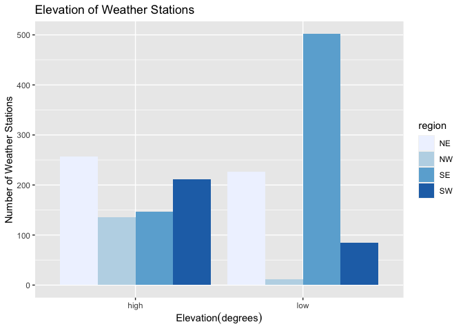
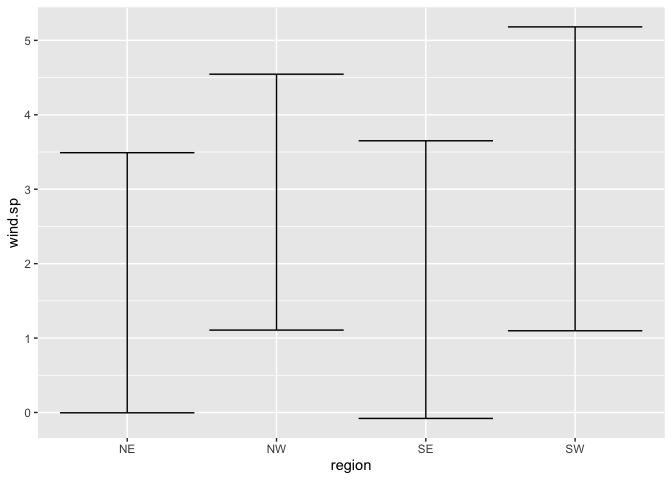
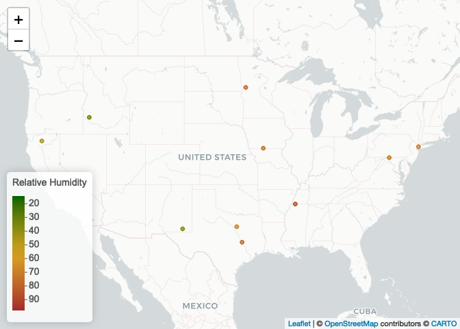
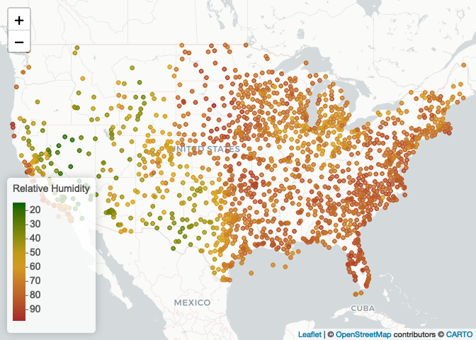
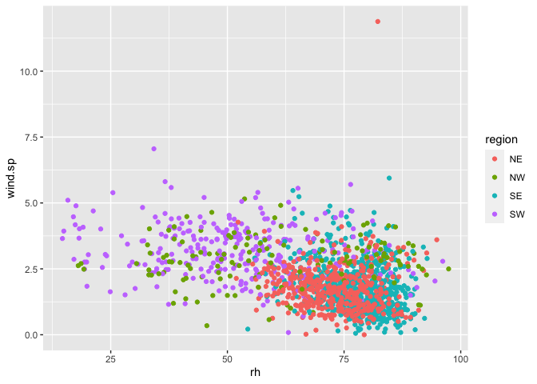

Lab 04
================
Megan Tran
\`September 14, 2022

``` r
library(lubridate)
```

    ## 
    ## Attaching package: 'lubridate'

    ## The following objects are masked from 'package:base':
    ## 
    ##     date, intersect, setdiff, union

``` r
library(tidyverse)
```

    ## ── Attaching packages
    ## ───────────────────────────────────────
    ## tidyverse 1.3.2 ──

    ## ✔ ggplot2 3.3.6     ✔ purrr   0.3.4
    ## ✔ tibble  3.1.8     ✔ dplyr   1.0.9
    ## ✔ tidyr   1.2.0     ✔ stringr 1.4.1
    ## ✔ readr   2.1.2     ✔ forcats 0.5.2
    ## ── Conflicts ────────────────────────────────────────── tidyverse_conflicts() ──
    ## ✖ lubridate::as.difftime() masks base::as.difftime()
    ## ✖ lubridate::date()        masks base::date()
    ## ✖ dplyr::filter()          masks stats::filter()
    ## ✖ lubridate::intersect()   masks base::intersect()
    ## ✖ dplyr::lag()             masks stats::lag()
    ## ✖ lubridate::setdiff()     masks base::setdiff()
    ## ✖ lubridate::union()       masks base::union()

``` r
library(data.table)
```

    ## 
    ## Attaching package: 'data.table'
    ## 
    ## The following objects are masked from 'package:dplyr':
    ## 
    ##     between, first, last
    ## 
    ## The following object is masked from 'package:purrr':
    ## 
    ##     transpose
    ## 
    ## The following objects are masked from 'package:lubridate':
    ## 
    ##     hour, isoweek, mday, minute, month, quarter, second, wday, week,
    ##     yday, year

## Step 1 Read in the data

First download and then read in with data.table:fread()

``` r
if (!file.exists("met_all.gz")) {
download.file("https://raw.githubusercontent.com/USCbiostats/data-science-data/master/02_met/met_all.gz", "met_all.gz", method="libcurl", timeout = 60) 
}
met <- data.table::fread("met_all.gz") 
```

\##Step 2 Prepare the Data

Remove temperatures less than -17C and Make sure there are no missing
data in the key variables coded as 9999, 999, etc

``` r
met <- met[temp> -17] [elev == 9999.0, elev := NA]
```

# check no 9999s in other important variables

Generate a date variable using the functions as.Date() (hint: You will
need the following to create a date paste(year, month, day, sep = “-”)).

``` r
met <- met[ , ymd:= as.Date(paste(year, month, day, sep = "-"))]
```

Using the data.table::week function, keep the observations of the first
week of the month.

``` r
met[, table(week(ymd))]
```

    ## 
    ##     31     32     33     34     35 
    ## 297259 521600 527922 523847 446576

``` r
met <- met[week(ymd)==31]
```

Compute the mean by station of the variables temp, rh, wind.sp,
vis.dist, dew.point, lat, lon, and elev.

``` r
met_avg <- met [, .(
  temp = max(temp,na.rm=T),
  rh = max(rh,na.rm=T),
  wind.sp = max(wind.sp,na.rm=T),
  vis.dist = max(vis.dist,na.rm=T),
  dew.point = max(dew.point,na.rm=T),
  lat = max(lat,na.rm=T),
  lon = max(lon,na.rm=T),
  elev = max(elev,na.rm=T)
)]
```

Great! No more 9999s in our dataset.

``` r
met_avg <- met [, .(
  temp = mean(temp,na.rm=T),
  rh = mean(rh,na.rm=T),
  wind.sp = mean(wind.sp,na.rm=T),
  vis.dist = mean(vis.dist,na.rm=T),
  dew.point = mean(dew.point,na.rm=T),
  lat = mean(lat,na.rm=T),
  lon = mean(lon,na.rm=T),
  elev = mean(elev,na.rm=T)
), by = 'USAFID'] 
```

Create a region variable for NW, SW, NE, SE based on lon = -98.00 and
lat = 39.71 degrees

``` r
met_avg <- met_avg[, region := fifelse(lon >= -98 & lat > 39.71, "NE", 
                fifelse(lon < -98 & lat > 39.71, "NW",
                fifelse(lon < -98 & lat <= 39.71, "SW","SE") ))]
table(met_avg$region)
```

    ## 
    ##  NE  NW  SE  SW 
    ## 484 146 649 296

Create a categorical variable for elevation as in the lecture slides

``` r
met_avg [, elev_cat := fifelse(elev > 252, "high", "low")]
```

## step 3 make violin plots of dew point temp by region

``` r
met_avg[!is.na(region)] %>% 
  ggplot() + 
  geom_violin(mapping = aes(x = 1, y = dew.point, fill=region)) + 
  facet_wrap(~ region, nrow = 1)
```

<!-- --> The highest
dew point temperatures are reported in the southeast

``` r
met_avg[!is.na(region) & !is.na(wind.sp)] %>% 
  ggplot() + 
  geom_violin(mapping = aes(x = 1, y = wind.sp, fill=region)) + 
  facet_wrap(~ region, nrow = 1)
```

<!-- --> The highest
wind speed is in the northeast.

## 4. Use geom_jitter with stat_smooth to examine the association between dew point temperature and wind speed by region

Colour points by region Make sure to deal with NA category Fit a linear
regression line by region Describe what you observe in the graph

``` r
met_avg[!is.na(region) & !is.na(wind.sp)] %>% 
  ggplot(mapping = aes(x=wind.sp, y = dew.point)) + 
  geom_point(mapping = aes(color = region)) + 
geom_smooth(mmethod = lm, mapping = aes(linetype = region)) +
facet_wrap (~ region, nrow=2)
```

    ## Warning: Ignoring unknown parameters: mmethod

    ## `geom_smooth()` using method = 'loess' and formula 'y ~ x'

<!-- -->
In all the regions, wind speed and dew point have little correlation
until wind speed reaches 2.5, then the variables are negatively
correlated.

\##5 Use geom_bar to create barplots of the weather stations by
elevation category coloured by region

``` r
met_avg %>%
filter(!(elev_cat %in% NA)) %>% 
  ggplot() + 
  geom_bar(mapping = aes(x = elev_cat, fill=region), position = "dodge") + scale_fill_brewer(palette = "Blues") +
  labs(title = "Elevation of Weather Stations") + 
  labs(x = expression("Elevation" * (degrees)), y = "Number of Weather Stations")
```

<!-- --> The number of
weather stations with high elevation is about the same for all regions.
But the northeast does have the most. For low elevation weather
stations, the Southeast region has the most by far and there or no low
elevation stations in the northeast.

\##6 Use stat_summary to examine mean dew point and wind speed by region
with standard deviation error bars

``` r
met_avg[!is.na(dew.point)] %>%
  ggplot(mapping = aes(x=region, y=dew.point)) + 
    stat_summary(fun.data = mean_sdl, 
  geom = "errorbar")
```

<!-- --> The mean dew
point temperature is highest for the SE region. The standard deviations
for NW and SW regions are similarly large. The standard deviations for
the NE and SE regions are similarly small.

``` r
met_avg[!is.na(wind.sp)] %>%
  ggplot(mapping = aes(x=region, y=wind.sp)) + 
    stat_summary(fun.data = mean_sdl, 
  geom = "errorbar")
```

<!-- --> Wind speed is
slightly highest in the SW region. All of the regions have about the
same standard deviations.

\##7. Make a map of weather stations and show trend in relative humidity
of top 10

``` r
library(leaflet)
met_avg2 <- met[,.(rh = mean(rh,na.rm=TRUE), lat = mean(lat), lon = mean(lon)),  by=c("USAFID")]
met_avg2 <- met_avg2[!is.na(rh)]


rh.pal <- colorNumeric(c('darkgreen','goldenrod','brown'), domain=met_avg2$rh)
rh.pal
```

    ## function (x) 
    ## {
    ##     if (length(x) == 0 || all(is.na(x))) {
    ##         return(pf(x))
    ##     }
    ##     if (is.null(rng)) 
    ##         rng <- range(x, na.rm = TRUE)
    ##     rescaled <- scales::rescale(x, from = rng)
    ##     if (any(rescaled < 0 | rescaled > 1, na.rm = TRUE)) 
    ##         warning("Some values were outside the color scale and will be treated as NA")
    ##     if (reverse) {
    ##         rescaled <- 1 - rescaled
    ##     }
    ##     pf(rescaled)
    ## }
    ## <bytecode: 0x7fa483fd5190>
    ## <environment: 0x7fa483fd87d8>
    ## attr(,"colorType")
    ## [1] "numeric"
    ## attr(,"colorArgs")
    ## attr(,"colorArgs")$na.color
    ## [1] "#808080"

Use addMarkers to include the top 10 places in relative h (hint: this
will be useful rank(-rh) \<= 10)

``` r
top10rh <- met_avg[order(-rh) <= 10 ]
```

``` r
#met_avg[order(-rh)][1:10]
```

``` r
rhmap <- leaflet(top10rh) %>% 
  # The looks of the Map
  addProviderTiles('CartoDB.Positron') %>% 
  # Some circles
  addCircles(
    lat = ~lat, lng=~lon,
                                                  # HERE IS OUR PAL!
    label = ~paste0(rh), color = ~ rh.pal(rh),
    opacity = 1, fillOpacity = 1, radius = 500
    ) %>%
  # And a pretty legend
  addLegend('bottomleft', pal=rh.pal, values=met_avg$rh,
          title='Relative Humidity', opacity=1)
rhmap
```

<!-- -->

``` r
rhmap <- leaflet(met_avg) %>% 
  # The looks of the Map
  addProviderTiles('CartoDB.Positron') %>% 
  # Some circles
  addCircles(
    lat = ~lat, lng=~lon,
                                                  # HERE IS OUR PAL!
    label = ~paste0(rh), color = ~ rh.pal(rh),
    opacity = 1, fillOpacity = 1, radius = 500
    ) %>%
  # And a pretty legend
  addLegend('bottomleft', pal=rh.pal, values=met_avg$rh,
          title='Relative Humidity', opacity=1)
rhmap
```

<!-- -->

The spatial trend in relative humidity across the US is that the eastern
side of the country as well as the West Coast are most humid. The west
side of the country is dry.

## 8. Use a ggplot extension

``` r
library(ggforce)
#> Loading required package: ggplot2
ggplot(met_avg, aes(rh, wind.sp, colour = region)) +
  geom_point() 
```

    ## Warning: Removed 15 rows containing missing values (geom_point).

<!-- -->
