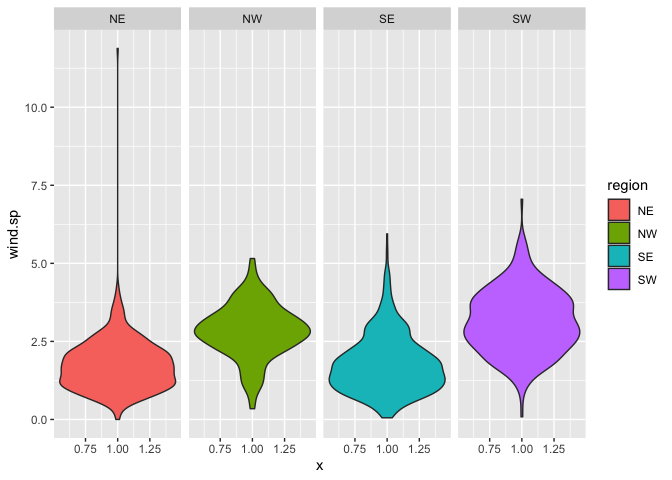
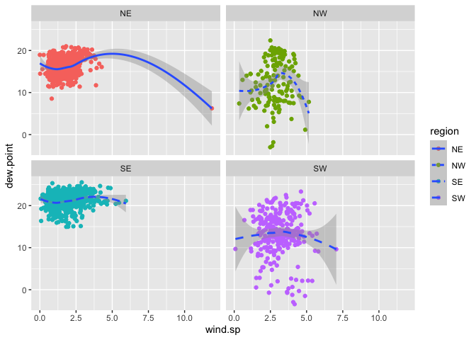

Lab 04
================
Megan Tran
\`September 14, 2022

``` r
library(lubridate)
```

    ## 
    ## Attaching package: 'lubridate'

    ## The following objects are masked from 'package:base':
    ## 
    ##     date, intersect, setdiff, union

``` r
library(tidyverse)
```

    ## ── Attaching packages
    ## ───────────────────────────────────────
    ## tidyverse 1.3.2 ──

    ## ✔ ggplot2 3.3.6     ✔ purrr   0.3.4
    ## ✔ tibble  3.1.8     ✔ dplyr   1.0.9
    ## ✔ tidyr   1.2.0     ✔ stringr 1.4.1
    ## ✔ readr   2.1.2     ✔ forcats 0.5.2
    ## ── Conflicts ────────────────────────────────────────── tidyverse_conflicts() ──
    ## ✖ lubridate::as.difftime() masks base::as.difftime()
    ## ✖ lubridate::date()        masks base::date()
    ## ✖ dplyr::filter()          masks stats::filter()
    ## ✖ lubridate::intersect()   masks base::intersect()
    ## ✖ dplyr::lag()             masks stats::lag()
    ## ✖ lubridate::setdiff()     masks base::setdiff()
    ## ✖ lubridate::union()       masks base::union()

``` r
library(data.table)
```

    ## 
    ## Attaching package: 'data.table'
    ## 
    ## The following objects are masked from 'package:dplyr':
    ## 
    ##     between, first, last
    ## 
    ## The following object is masked from 'package:purrr':
    ## 
    ##     transpose
    ## 
    ## The following objects are masked from 'package:lubridate':
    ## 
    ##     hour, isoweek, mday, minute, month, quarter, second, wday, week,
    ##     yday, year

## Step 1 Read in the data

First download and then read in with data.table:fread()

``` r
if (!file.exists("met_all.gz")) {
download.file("https://raw.githubusercontent.com/USCbiostats/data-science-data/master/02_met/met_all.gz", "met_all.gz", method="libcurl", timeout = 60) 
}
met <- data.table::fread("met_all.gz") 
```

\##Step 2 Prepare the Data

Remove temperatures less than -17C and Make sure there are no missing
data in the key variables coded as 9999, 999, etc

``` r
met <- met[temp> -17] [elev == 9999.0, elev := NA]
```

# check no 9999s in other important variables

Generate a date variable using the functions as.Date() (hint: You will
need the following to create a date paste(year, month, day, sep = “-”)).

``` r
met <- met[ , ymd:= as.Date(paste(year, month, day, sep = "-"))]
```

Using the data.table::week function, keep the observations of the first
week of the month.

``` r
met[, table(week(ymd))]
```

    ## 
    ##     31     32     33     34     35 
    ## 297259 521600 527922 523847 446576

``` r
met <- met[week(ymd)==31]
```

Compute the mean by station of the variables temp, rh, wind.sp,
vis.dist, dew.point, lat, lon, and elev.

``` r
met_avg <- met [, .(
  temp = max(temp,na.rm=T),
  rh = max(rh,na.rm=T),
  wind.sp = max(wind.sp,na.rm=T),
  vis.dist = max(vis.dist,na.rm=T),
  dew.point = max(dew.point,na.rm=T),
  lat = max(lat,na.rm=T),
  lon = max(lon,na.rm=T),
  elev = max(elev,na.rm=T)
)]
```

Great! No more 9999s in our dataset.

``` r
met_avg <- met [, .(
  temp = mean(temp,na.rm=T),
  rh = mean(rh,na.rm=T),
  wind.sp = mean(wind.sp,na.rm=T),
  vis.dist = mean(vis.dist,na.rm=T),
  dew.point = mean(dew.point,na.rm=T),
  lat = mean(lat,na.rm=T),
  lon = mean(lon,na.rm=T),
  elev = mean(elev,na.rm=T)
), by = 'USAFID'] 
```

Create a region variable for NW, SW, NE, SE based on lon = -98.00 and
lat = 39.71 degrees

``` r
met_avg <- met[, region := fifelse(lon >= -98 & lat > 39.71, "NE", 
                fifelse(lon < -98 & lat > 39.71, "NW",
                fifelse(lon < -98 & lat <= 39.71, "SW","SE") ))]
table(met_avg$region)
```

    ## 
    ##     NE     NW     SE     SW 
    ##  97578  26408 123882  49391

Create a categorical variable for elevation as in the lecture slides

``` r
met_avg [, elev_cat := fifelse(elev > 252, "high", "low")]
```

## step 3 make violin plots of dew point temp by region

``` r
met_avg[!is.na(region)] %>% 
  ggplot() + 
  geom_point(mapping = aes(x = 1, y = dew.point, fill=region)) + 
  facet_wrap(~ region, nrow = 1)
```

    ## Warning: Removed 549 rows containing missing values (geom_point).

<!-- --> The highest
dew point temperatures are reported in the southeast

``` r
met_avg[!is.na(region) & !is.na(wind.sp)] %>% 
  ggplot() + 
  geom_point(mapping = aes(x = 1, y = wind.sp, fill=region)) + 
  facet_wrap(~ region, nrow = 1)
```

<!-- --> comment on
results

## 4. Use geom_jitter with stat_smooth to examine the association between dew point temperature and wind speed by region

Colour points by region Make sure to deal with NA category Fit a linear
regression line by region Describe what you observe in the graph

``` r
met_avg[!is.na(region) & !is.na(wind.sp)] %>% 
  ggplot(mapping = aes(x=wind.sp, y = dew.point)) + 
  geom_point(mapping = aes(color = region)) + 
geom_smooth(mmethod = lm, mapping = aes(linetype = region)) +
facet_wrap (~ region, nrow=2)
```

    ## Warning: Ignoring unknown parameters: mmethod

    ## `geom_smooth()` using method = 'gam' and formula 'y ~ s(x, bs = "cs")'

    ## Warning: Removed 416 rows containing non-finite values (stat_smooth).

    ## Warning: Removed 416 rows containing missing values (geom_point).

<!-- -->
comment on results
