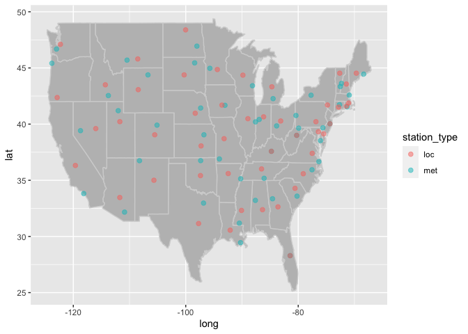

lab05
================
Megan Tran
\`September 21, 2022

``` r
library(lubridate)
```

    ## 
    ## Attaching package: 'lubridate'

    ## The following objects are masked from 'package:base':
    ## 
    ##     date, intersect, setdiff, union

``` r
library(tidyverse)
```

    ## ── Attaching packages
    ## ───────────────────────────────────────
    ## tidyverse 1.3.2 ──

    ## ✔ ggplot2 3.3.6     ✔ purrr   0.3.4
    ## ✔ tibble  3.1.8     ✔ dplyr   1.0.9
    ## ✔ tidyr   1.2.0     ✔ stringr 1.4.1
    ## ✔ readr   2.1.2     ✔ forcats 0.5.2
    ## ── Conflicts ────────────────────────────────────────── tidyverse_conflicts() ──
    ## ✖ lubridate::as.difftime() masks base::as.difftime()
    ## ✖ lubridate::date()        masks base::date()
    ## ✖ dplyr::filter()          masks stats::filter()
    ## ✖ lubridate::intersect()   masks base::intersect()
    ## ✖ dplyr::lag()             masks stats::lag()
    ## ✖ lubridate::setdiff()     masks base::setdiff()
    ## ✖ lubridate::union()       masks base::union()

``` r
library(data.table)
```

    ## 
    ## Attaching package: 'data.table'
    ## 
    ## The following objects are masked from 'package:dplyr':
    ## 
    ##     between, first, last
    ## 
    ## The following object is masked from 'package:purrr':
    ## 
    ##     transpose
    ## 
    ## The following objects are masked from 'package:lubridate':
    ## 
    ##     hour, isoweek, mday, minute, month, quarter, second, wday, week,
    ##     yday, year

``` r
library(dtplyr)
```

## 1. Read in the data

``` r
if (!file.exists("../lab03/met_all.gz")) {
download.file("https://raw.githubusercontent.com/USCbiostats/data-science-data/master/02_met/met_all.gz", "met_all.gz", method="libcurl", timeout = 60) 
}
met <- data.table::fread("../lab03/met_all.gz") 
```

Remove temperatures less than -17C and Make sure there are no missing
data in the key variables coded as 9999, 999, etc

``` r
met <- met[temp> -17] [elev == 9999.0, elev := NA]
```

Read in the stations data:

``` r
# Download the data
stations <- fread("ftp://ftp.ncdc.noaa.gov/pub/data/noaa/isd-history.csv")
stations[, USAF := as.integer(USAF)]
```

    ## Warning in eval(jsub, SDenv, parent.frame()): NAs introduced by coercion

``` r
# Dealing with NAs and 999999
stations[, USAF   := fifelse(USAF == 999999, NA_integer_, USAF)]
stations[, CTRY   := fifelse(CTRY == "", NA_character_, CTRY)]
stations[, STATE  := fifelse(STATE == "", NA_character_, STATE)]

# Selecting the three relevant columns, and keeping unique records
stations <- unique(stations[, list(USAF, CTRY, STATE)])

# Dropping NAs
stations <- stations[!is.na(USAF)]  

# Removing duplicates
stations[, n := 1:.N, by = .(USAF)]
stations <- stations[n == 1,][, n := NULL]
```

merge met data with stations.

``` r
met <-
merge(
  # Data
  x     = met,      
  y     = stations, 
  # List of variables to match
  by.x  = "USAFID",
  by.y  = "USAF", 
  # Which obs to keep?
  all.x = TRUE,      
  all.y = FALSE
  ) 

nrow(met)
```

    ## [1] 2317204

\##Question 1: Representative station for the US

Compute mean temperature, wind speed and atmospheric pressure for each
weather station, and pick the weather station with the average value
closest to the median for the US.

``` r
station_averages <-
  met[ , .(
    temp = mean (temp, na.rm=T),
    wind.sp = mean(wind.sp, na.rm=T),
    atm.press = mean(atm.press, na.rm=T)
  ), by = USAFID]
```

The above computes the mean by weather station. Now let’s compute the
median value for each variable.

``` r
stmeds <- station_averages[ , .(
          temp50     = median(temp, na.rm=T),
          windsp50   = median(wind.sp, na.rm=T),
          atmpress50 = median(atm.press,na.rm=T)
)]
stmeds
```

    ##      temp50 windsp50 atmpress50
    ## 1: 23.68406 2.463685   1014.691

A helpful function we might want to use ’which.min()”

``` r
station_averages [ , 
                   temp_dist50 := abs(temp - stmeds$temp50)][order(temp_dist50)]
```

    ##       USAFID      temp   wind.sp atm.press  temp_dist50
    ##    1: 720458 23.681730  1.209682       NaN  0.002328907
    ##    2: 725515 23.686388  2.709164       NaN  0.002328907
    ##    3: 725835 23.678347  2.652381       NaN  0.005712423
    ##    4: 724509 23.675100  4.066833  1013.863  0.008959632
    ##    5: 720538 23.665932  1.907897       NaN  0.018127186
    ##   ---                                                  
    ## 1584: 722788 36.852459  3.393852       NaN 13.168399783
    ## 1585: 722787 37.258907  2.847381       NaN 13.574848130
    ## 1586: 723805 37.625391  3.532935  1005.207 13.941331392
    ## 1587: 726130  9.189602 12.239908       NaN 14.494456787
    ## 1588: 720385  8.044959  7.298963       NaN 15.639100105

Let’s use which.min

``` r
station_averages[ which.min(temp_dist50)]
```

    ##    USAFID     temp  wind.sp atm.press temp_dist50
    ## 1: 720458 23.68173 1.209682       NaN 0.002328907

It matches the result above.

``` r
station_averages [ , 
                   wind.sp_dist50 := abs(wind.sp - stmeds$wind.sp50)][order(wind.sp_dist50)]
```

    ##       USAFID     temp  wind.sp atm.press temp_dist50 wind.sp_dist50
    ##    1: 690150 33.18763 3.483560  1010.379   9.5035752             NA
    ##    2: 720110 31.22003 2.138348       NaN   7.5359677             NA
    ##    3: 720113 23.29317 2.470298       NaN   0.3908894             NA
    ##    4: 720120 27.01922 2.503079       NaN   3.3351568             NA
    ##    5: 720137 21.88823 1.979335       NaN   1.7958292             NA
    ##   ---                                                              
    ## 1584: 726777 19.15492 4.673878  1014.299   4.5291393             NA
    ## 1585: 726797 18.78980 2.858281  1014.902   4.8942607             NA
    ## 1586: 726798 19.47014 4.449337  1014.072   4.2139153             NA
    ## 1587: 726810 25.03549 3.037356  1011.730   1.3514356             NA
    ## 1588: 726813 23.47809 2.435372  1012.315   0.2059716             NA

``` r
station_averages [ , 
                   atmpress_dist50 := abs(atm.press - stmeds$atmpress50)][order(atmpress_dist50)]
```

    ##       USAFID     temp  wind.sp atm.press temp_dist50 wind.sp_dist50
    ##    1: 722238 26.13978 1.470619  1014.691   2.4557194             NA
    ##    2: 723200 25.82436 1.537661  1014.692   2.1403044             NA
    ##    3: 726539 19.66441 4.992422  1014.693   4.0196479             NA
    ##    4: 726155 19.96899 1.961019  1014.689   3.7150670             NA
    ##    5: 725245 23.27650 4.178176  1014.696   0.4075615             NA
    ##   ---                                                              
    ## 1584: 726605 19.21773 3.069577       NaN   4.4663320             NA
    ## 1585: 726626 16.71839 2.296709       NaN   6.9656643             NA
    ## 1586: 726679 18.34283 1.392624       NaN   5.3412312             NA
    ## 1587: 726682 19.85487 1.872846       NaN   3.8291864             NA
    ## 1588: 726764 14.33917 2.144424       NaN   9.3448858             NA
    ##       atmpress_dist50
    ##    1:    0.0005376377
    ##    2:    0.0005376377
    ##    3:    0.0018782247
    ##    4:    0.0024385972
    ##    5:    0.0046850588
    ##   ---                
    ## 1584:             NaN
    ## 1585:             NaN
    ## 1586:             NaN
    ## 1587:             NaN
    ## 1588:             NaN

## Question 2: Representative station per state

Just like the previous question, you are asked to identify what is the
most representative, the median, station per state. This time, instead
of looking at one variable at a time, look at the euclidean distance. If
multiple stations show in the median, select the one located at the
lowest latitude.

``` r
station_averages <- 
     met[ , .(
       temp      = mean(temp, na.rm=T),
       wind.sp   = mean(wind.sp, na.rm=T),
       atm.press = mean(atm.press,na.rm=T)
     ), by = .(USAFID,STATE)]
head(station_averages)
```

    ##    USAFID STATE     temp  wind.sp atm.press
    ## 1: 690150    CA 33.18763 3.483560  1010.379
    ## 2: 720110    TX 31.22003 2.138348       NaN
    ## 3: 720113    MI 23.29317 2.470298       NaN
    ## 4: 720120    SC 27.01922 2.503079       NaN
    ## 5: 720137    IL 21.88823 1.979335       NaN
    ## 6: 720151    TX 27.57686 2.998428       NaN

``` r
statemeds <- station_averages[ , .(
          temp50     = median(temp, na.rm=T),
          windsp50   = median(wind.sp, na.rm=T)
          ), by = STATE]
statemeds
```

    ##     STATE   temp50 windsp50
    ##  1:    CA 22.66268 2.561738
    ##  2:    TX 29.75188 3.413810
    ##  3:    MI 20.51970 2.273423
    ##  4:    SC 25.80545 1.696119
    ##  5:    IL 22.43194 2.237652
    ##  6:    MO 23.95109 2.453547
    ##  7:    AR 26.24296 1.938625
    ##  8:    OR 17.98061 2.011436
    ##  9:    WA 19.24684 1.268571
    ## 10:    GA 26.70404 1.497527
    ## 11:    MN 19.63017 2.616482
    ## 12:    AL 26.33664 1.662132
    ## 13:    IN 22.25059 2.344333
    ## 14:    NC 24.72953 1.627306
    ## 15:    VA 24.37799 1.654183
    ## 16:    IA 21.33461 2.680875
    ## 17:    PA 21.69177 1.784167
    ## 18:    NE 21.87354 3.192539
    ## 19:    ID 20.56798 2.568944
    ## 20:    WI 18.85524 2.053283
    ## 21:    WV 21.94446 1.632107
    ## 22:    MD 24.89883 1.883499
    ## 23:    AZ 30.32372 3.074359
    ## 24:    OK 27.14427 3.852697
    ## 25:    WY 19.80699 3.873986
    ## 26:    LA 27.87430 1.712535
    ## 27:    KY 23.88844 1.895486
    ## 28:    FL 27.57325 2.705069
    ## 29:    CO 21.52650 3.098777
    ## 30:    OH 22.02062 2.554138
    ## 31:    NJ 23.47238 2.148058
    ## 32:    NM 24.94447 3.776083
    ## 33:    KS 24.21220 3.676997
    ## 34:    ND 18.52849 3.956459
    ## 35:    VT 18.61379 1.408247
    ## 36:    MS 26.69258 1.637030
    ## 37:    CT 22.36880 2.101294
    ## 38:    NV 24.56293 3.035050
    ## 39:    UT 24.35182 3.110795
    ## 40:    SD 20.35662 3.665638
    ## 41:    TN 24.88657 1.576035
    ## 42:    NY 20.40674 2.304075
    ## 43:    RI 22.53551 2.583469
    ## 44:    MA 21.30662 2.710944
    ## 45:    DE 24.56026 2.753082
    ## 46:    NH 19.55054 1.563826
    ## 47:    ME 18.79016 2.237210
    ## 48:    MT 19.15492 4.151737
    ##     STATE   temp50 windsp50

``` r
station_averages <- 
  merge(
  x = station_averages,
  y = statemeds,
  by.x = "STATE",
  by.y = "STATE",
  all.x = TRUE,
  all.y = FALSE
)
```

``` r
station_averages[ , temp_dist_state50 := temp - temp50]
station_averages[ , windsp_dist_state50 := wind.sp - windsp50]
station_averages
```

    ##       STATE USAFID     temp  wind.sp atm.press   temp50 windsp50
    ##    1:    AL 720265 26.22064 1.136691       NaN 26.33664 1.662132
    ##    2:    AL 720307 25.14605 1.624349       NaN 26.33664 1.662132
    ##    3:    AL 720361 26.62228 1.343410  1015.275 26.33664 1.662132
    ##    4:    AL 720362 27.26504 1.746168  1014.559 26.33664 1.662132
    ##    5:    AL 720376 24.97884 1.296044       NaN 26.33664 1.662132
    ##   ---                                                           
    ## 1584:    WY 726667 23.10219 3.290873  1012.276 19.80699 3.873986
    ## 1585:    WY 726690 20.51681 4.242981  1013.000 19.80699 3.873986
    ## 1586:    WY 726700 19.97665 3.066306  1015.219 19.80699 3.873986
    ## 1587:    WY 726710 16.86569 3.492218  1014.945 19.80699 3.873986
    ## 1588:    WY 726720 21.70287 3.800334  1012.771 19.80699 3.873986
    ##       temp_dist_state50 windsp_dist_state50
    ##    1:        -0.1159996         -0.52544171
    ##    2:        -1.1905914         -0.03778375
    ##    3:         0.2856450         -0.31872221
    ##    4:         0.9284033          0.08403570
    ##    5:        -1.3577997         -0.36608819
    ##   ---                                      
    ## 1584:         3.2951940         -0.58311300
    ## 1585:         0.7098198          0.36899535
    ## 1586:         0.1696556         -0.80768036
    ## 1587:        -2.9412986         -0.38176812
    ## 1588:         1.8958786         -0.07365157

``` r
station_averages [, eucdist := temp_dist_state50^2 +
                                windsp_dist_state50^2]
```

``` r
repstation <- station_averages [, .(
                  eucdist = min(eucdist, na.rm=T))
                  , by=STATE]
```

Now I’ll find the station with the lowest Euclidean distance to the
median temperature and wind speed by merging these minimum distances
back with the station names, and only saving the records that include
the minimum Euclidean distance.

``` r
repweather <- 
  merge(
  x = station_averages,
  y = repstation,
  by.x = c("eucdist","STATE"),
  by.y = c("eucdist","STATE"),
  all.x = FALSE,
  all.y = TRUE
)
repweather
```

    ##          eucdist STATE USAFID     temp  wind.sp atm.press   temp50 windsp50
    ##  1: 0.0000000000    DE 724180 24.56026 2.753082  1015.046 24.56026 2.753082
    ##  2: 0.0000000000    MD 722218 24.89883 1.883499       NaN 24.89883 1.883499
    ##  3: 0.0000000000    NJ 724090 23.47238 2.148058  1015.095 23.47238 2.148058
    ##  4: 0.0000000000    WA 720254 19.24684 1.268571       NaN 19.24684 1.268571
    ##  5: 0.0003044727    WV 720328 21.94820 1.615064       NaN 21.94446 1.632107
    ##  6: 0.0003044727    WV 724176 21.94072 1.649151  1015.982 21.94446 1.632107
    ##  7: 0.0006410156    AL 722286 26.35793 1.675828  1014.909 26.33664 1.662132
    ##  8: 0.0009745369    FL 722011 27.56952 2.674074  1016.063 27.57325 2.705069
    ##  9: 0.0020160519    IA 725464 21.37948 2.679227       NaN 21.33461 2.680875
    ## 10: 0.0021721657    GA 722197 26.70404 1.544133  1015.574 26.70404 1.497527
    ## 11: 0.0030365498    LA 722041 27.84758 1.760730       NaN 27.87430 1.712535
    ## 12: 0.0037790245    VA 724006 24.31662 1.650539       NaN 24.37799 1.654183
    ## 13: 0.0069584784    OK 720625 27.06188 3.865717       NaN 27.14427 3.852697
    ## 14: 0.0077712543    IL 722076 22.34403 2.244115       NaN 22.43194 2.237652
    ## 15: 0.0081925142    WI 726413 18.94233 2.028610       NaN 18.85524 2.053283
    ## 16: 0.0090257850    NE 725565 21.86100 3.098367  1015.068 21.87354 3.192539
    ## 17: 0.0091213936    NC 720864 24.82394 1.612864       NaN 24.72953 1.627306
    ## 18: 0.0093580816    NY 724988 20.44142 2.394383  1016.233 20.40674 2.304075
    ## 19: 0.0123577703    WY 726654 19.85844 3.775443  1014.107 19.80699 3.873986
    ## 20: 0.0132319539    MI 725395 20.44096 2.357275  1015.245 20.51970 2.273423
    ## 21: 0.0144022476    MA 725088 21.20391 2.773018  1013.718 21.30662 2.710944
    ## 22: 0.0153070309    TX 722598 29.81293 3.521417       NaN 29.75188 3.413810
    ## 23: 0.0159151165    IN 724386 22.32575 2.243013  1014.797 22.25059 2.344333
    ## 24: 0.0183564932    UT 725750 24.23571 3.040962  1011.521 24.35182 3.110795
    ## 25: 0.0327455867    SC 723107 25.95831 1.599275       NaN 25.80545 1.696119
    ## 26: 0.0339881655    PA 725204 21.87141 1.825605       NaN 21.69177 1.784167
    ## 27: 0.0348669121    ND 720911 18.34248 3.940128       NaN 18.52849 3.956459
    ## 28: 0.0351865214    MS 722358 26.54093 1.747426  1014.722 26.69258 1.637030
    ## 29: 0.0375202070    TN 720974 24.71645 1.483411       NaN 24.88657 1.576035
    ## 30: 0.0416560272    MO 720479 24.14775 2.508153       NaN 23.95109 2.453547
    ## 31: 0.0427670273    NM 723658 24.94447 3.569281  1013.917 24.94447 3.776083
    ## 32: 0.0433144478    CT 725087 22.57539 2.126514  1014.534 22.36880 2.101294
    ## 33: 0.0512183083    MN 726553 19.67552 2.394756       NaN 19.63017 2.616482
    ## 34: 0.0544857836    AZ 722745 30.31538 3.307632  1010.144 30.32372 3.074359
    ## 35: 0.0557784421    KS 724550 24.14958 3.449278  1013.315 24.21220 3.676997
    ## 36: 0.0634001463    OH 724295 21.97211 2.801214  1015.742 22.02062 2.554138
    ## 37: 0.0651314631    CA 722970 22.76040 2.325982  1012.710 22.66268 2.561738
    ## 38: 0.0668411712    RI 725079 22.27697 2.583469  1014.620 22.53551 2.583469
    ## 39: 0.0777385965    ID 725867 20.81272 2.702517  1012.802 20.56798 2.568944
    ## 40: 0.0942851270    VT 726115 18.60548 1.101301  1014.985 18.61379 1.408247
    ## 41: 0.0943820541    ME 726077 18.49969 2.337241  1014.475 18.79016 2.237210
    ## 42: 0.1065472295    NH 726116 19.23920 1.465766  1013.840 19.55054 1.563826
    ## 43: 0.1710841308    SD 726590 19.95928 3.550722  1014.284 20.35662 3.665638
    ## 44: 0.1736376706    AR 722054 26.58944 1.707136  1014.127 26.24296 1.938625
    ## 45: 0.1879315944    MT 726798 19.47014 4.449337  1014.072 19.15492 4.151737
    ## 46: 0.2125405164    KY 720448 23.52994 1.605628       NaN 23.88844 1.895486
    ## 47: 0.2380402433    NV 724885 24.78430 2.600266  1013.825 24.56293 3.035050
    ## 48: 0.2382427502    CO 724699 21.94228 2.843091       NaN 21.52650 3.098777
    ## 49: 0.7028808653    OR 720202 17.16329 1.824696       NaN 17.98061 2.011436
    ##          eucdist STATE USAFID     temp  wind.sp atm.press   temp50 windsp50
    ##     temp_dist_state50 windsp_dist_state50
    ##  1:       0.000000000         0.000000000
    ##  2:       0.000000000         0.000000000
    ##  3:       0.000000000         0.000000000
    ##  4:       0.000000000         0.000000000
    ##  5:       0.003739818        -0.017043664
    ##  6:      -0.003739818         0.017043664
    ##  7:       0.021294174         0.013695758
    ##  8:      -0.003722957        -0.030994782
    ##  9:       0.044870212        -0.001648046
    ## 10:       0.000000000         0.046606498
    ## 11:      -0.026716512         0.048195205
    ## 12:      -0.061365678        -0.003643902
    ## 13:      -0.082395169         0.013019775
    ## 14:      -0.087917451         0.006463443
    ## 15:       0.087084812        -0.024672854
    ## 16:      -0.012543905        -0.094172371
    ## 17:       0.094407682        -0.014442410
    ## 18:       0.034676267         0.090308571
    ## 19:       0.051448939        -0.098543275
    ## 20:      -0.078745377         0.083851771
    ## 21:      -0.102708664         0.062073971
    ## 22:       0.061055783         0.107606795
    ## 23:       0.075162869        -0.101319591
    ## 24:      -0.116102741        -0.069832992
    ## 25:       0.152861989        -0.096844200
    ## 26:       0.179641362         0.041438466
    ## 27:      -0.186011382        -0.016330272
    ## 28:      -0.151654911         0.110396147
    ## 29:      -0.170120726        -0.092623677
    ## 30:       0.196657661         0.054605785
    ## 31:       0.000000000        -0.206801904
    ## 32:       0.206587513         0.025219975
    ## 33:       0.045341660        -0.221726052
    ## 34:      -0.008341255         0.233272817
    ## 35:      -0.062628803        -0.227719290
    ## 36:      -0.048515527         0.247075676
    ## 37:       0.097726713        -0.235756129
    ## 38:      -0.258536596         0.000000000
    ## 39:       0.244738817         0.133572108
    ## 40:      -0.008312123        -0.306946307
    ## 41:      -0.290475361         0.100030588
    ## 42:      -0.311337973        -0.098060676
    ## 43:      -0.397339331        -0.114915562
    ## 44:       0.346482848        -0.231489323
    ## 45:       0.315223976         0.297599461
    ## 46:      -0.358501256        -0.289857492
    ## 47:       0.221366082        -0.434784201
    ## 48:       0.415773719        -0.255685285
    ## 49:      -0.817318253        -0.186739760
    ##     temp_dist_state50 windsp_dist_state50

Phew! We found the stations with temperture and wind speed closest in
Euclidean distance to the median temp and median wind speed in the
state.

\##Question 3: in the middle?

For each state, identify what is the station that is closest to the
mid-point of the state. Combining these with the stations you identified
in the previous question, use leaflet() to visualize all \~100 points in
the same figure, applying different colors for those identified in this
question. Get station locations:

``` r
met_stations <- unique(met[, .(USAFID, STATE, lon, lat)])
nrow(met_stations)
```

    ## [1] 2827

``` r
length(unique(met$USAFID))
```

    ## [1] 1588

I have more station locations than I have stations. Some stations must
have been moved at some point. I will pick the locations from the
earliest recording in the month.

``` r
met_stations <- unique(met[order(USAFID,day,hour)][, .(USAFID, STATE, lon, lat)])
met_stations[, n := 1:.N, by=USAFID]
met_stations <- met_stations[n == 1][, n:= NULL]
nrow(met_stations)
```

    ## [1] 1588

Now let’s find the central location of these weather stations by state.
To do this we compute the distance from each station to the central
location, and grab the station with the smallest distance.

``` r
met_stations[, lat_mid := quantile(lat, probs = .5, na.rm = TRUE), by=STATE]
met_stations[, lon_mid := quantile(lon, probs = .5, na.rm = TRUE), by=STATE]
# Looking at the euclidean distances
met_stations[, dist := sqrt((lat-lat_mid)^2+(lon-lon_mid)^2)]
met_stations[, mindist := which.min(dist), by=STATE]
```

Now let’s create an index for each station by state, so we can pick the
record that yielded the minimum distance.

``` r
met_stations[, n := 1:.N, by=STATE]
met_stations[order(STATE,dist)]
```

    ##       USAFID STATE      lon    lat lat_mid   lon_mid      dist mindist  n
    ##    1: 722265    AL  -86.350 32.383 32.7655  -86.5840 0.4483997      17 17
    ##    2: 722300    AL  -86.782 33.178 32.7655  -86.5840 0.4575590      17 29
    ##    3: 722260    AL  -86.400 32.300 32.7655  -86.5840 0.5005460      17 16
    ##    4: 720265    AL  -85.963 32.915 32.7655  -86.5840 0.6387419      17  1
    ##    5: 722280    AL  -86.745 33.566 32.7655  -86.5840 0.8165300      17 24
    ##   ---                                                                    
    ## 1584: 725645    WY -105.683 41.317 42.8055 -108.2355 2.9548077      26  9
    ## 1585: 726650    WY -105.541 44.339 42.8055 -108.2355 3.1003149      26 17
    ## 1586: 725775    WY -111.030 41.273 42.8055 -108.2355 3.1871283      26 15
    ## 1587: 725640    WY -104.800 41.150 42.8055 -108.2355 3.8135732      26  8
    ## 1588: 725763    WY -104.158 42.061 42.8055 -108.2355 4.1449109      26 14

Notice how min.dist == n for the station with the shortest distance in
AL. We’ll select these for each state, and just save the station id,
state and location information.

``` r
met_location <- met_stations[n == mindist, .(USAFID, STATE, lon, lat)][order(STATE)]
met_location
```

    ##     USAFID STATE      lon    lat
    ##  1: 722265    AL  -86.350 32.383
    ##  2: 720401    AR  -92.450 35.600
    ##  3: 722783    AZ -111.733 33.467
    ##  4: 723898    CA -119.628 36.319
    ##  5: 726396    CO -105.516 39.050
    ##  6: 725027    CT  -72.828 41.510
    ##  7: 724088    DE  -75.467 39.133
    ##  8: 722011    FL  -81.437 28.290
    ##  9: 722175    GA  -83.600 32.633
    ## 10: 725466    IA  -93.566 41.691
    ## 11: 725865    ID -114.300 43.500
    ## 12: 724397    IL  -88.950 40.483
    ## 13: 725335    IN  -86.152 40.648
    ## 14: 724509    KS  -97.275 38.058
    ## 15: 720448    KY  -84.770 37.578
    ## 16: 720468    LA  -92.099 30.558
    ## 17: 725068    MA  -71.021 41.876
    ## 18: 724067    MD  -76.414 39.326
    ## 19: 726073    ME  -69.667 44.533
    ## 20: 725405    MI  -84.688 43.322
    ## 21: 726569    MN  -94.382 44.859
    ## 22: 724453    MO  -93.183 38.704
    ## 23: 722350    MS  -90.083 32.317
    ## 24: 726770    MT -108.533 45.800
    ## 25: 722201    NC  -79.101 35.582
    ## 26: 720867    ND -100.024 48.390
    ## 27: 725520    NE  -98.317 40.967
    ## 28: 726155    NH  -71.433 43.567
    ## 29: 724090    NJ  -74.350 40.033
    ## 30: 722677    NM -105.662 35.003
    ## 31: 724770    NV -116.005 39.601
    ## 32: 725145    NY  -74.795 41.702
    ## 33: 720928    OH  -83.115 40.280
    ## 34: 723540    OK  -97.383 35.417
    ## 35: 725970    OR -122.867 42.367
    ## 36: 725118    PA  -76.851 40.217
    ## 37: 725074    RI  -71.412 41.597
    ## 38: 720603    SC  -80.567 34.283
    ## 39: 726560    SD -100.285 44.381
    ## 40: 723273    TN  -86.520 36.009
    ## 41: 722570    TX  -97.717 31.150
    ## 42: 725724    UT -111.723 40.219
    ## 43: 720498    VA  -77.517 37.400
    ## 44: 726114    VT  -72.614 44.534
    ## 45: 720388    WA -122.287 47.104
    ## 46: 726452    WI  -89.837 44.359
    ## 47: 720328    WV  -80.274 39.000
    ## 48: 726720    WY -108.450 43.067
    ##     USAFID STATE      lon    lat

Notice how there are only 48 states selected. Using which.min will
select the first occurrence, and therefore does not return multiple
records per state if there are ties.

Let’s add these to the stations from the previous question and plot
their locations on a map of the US. I’ll use ggplot() this time for a
static plot, instead of a dynamic plot in leaflet().

First, get the locations for the stations from Q2.

``` r
repweather <-
  merge(
  x =   repweather[, .(USAFID, STATE)],
  y = met_stations[, .(USAFID, STATE, lat, lon)],
  by.x = c("USAFID","STATE"),
  by.y = c("USAFID","STATE"),
  all.x = TRUE,
  all.y = FALSE
) 

repweather[, station_type := "met"]
met_location <- met_location[, .(USAFID, STATE, lat, lon)][, station_type := "loc"]
all_stations <- rbind(repweather, met_location, use.names=TRUE)
```

``` r
# Visualizing the data
ggplot(map_data("state"), aes(x = long, y = lat)) +
  geom_map(aes(map_id = region), map = map_data("state"), col = "lightgrey", fill = "gray") +
  geom_point(
    data    = all_stations,
    mapping = aes(x = lon, y = lat, col = station_type),
    inherit.aes = FALSE, cex = 2, alpha = 0.5
    )
```

<!-- -->

The orange dots show the weather stations most central to all locations
in the state, and the aqua dots show those with weather that’s most
repesentative of the weather in the state. Most states have 2 dots. In
Florida, Kentucky, and West Virginia there is only 1 dot, and the color
appears to be a combination of the 2 colors in the legend, meaning it’s
the same weather station that is centrally located and reporting the
average weather for the state.

\##Question 4: means of means

Using the quantile() function, generate a summary table that shows the
number of states included, average temperature, wind-speed, and
atmospheric pressure by the variable “average temperature level,” which
you’ll need to create.

Start by computing the states’ average temperature. Use that measurement
to classify them according to the following criteria:

low: temp \< 20 Mid: temp \>= 20 and temp \< 25 High: temp \>= 25

``` r
met[, state_temp := mean(temp, na.rm = TRUE), by = STATE]
met[, temp_cat := fifelse(
  state_temp < 20, "low-temp", 
  fifelse(state_temp < 25, "mid-temp", "high-temp"))
  ]
head(met)
```

    ##    USAFID  WBAN year month day hour min  lat      lon elev wind.dir wind.dir.qc
    ## 1: 690150 93121 2019     8   1    0  56 34.3 -116.166  696      220           5
    ## 2: 690150 93121 2019     8   1    1  56 34.3 -116.166  696      230           5
    ## 3: 690150 93121 2019     8   1    2  56 34.3 -116.166  696      230           5
    ## 4: 690150 93121 2019     8   1    3  56 34.3 -116.166  696      210           5
    ## 5: 690150 93121 2019     8   1    4  56 34.3 -116.166  696      120           5
    ## 6: 690150 93121 2019     8   1    5  56 34.3 -116.166  696       NA           9
    ##    wind.type.code wind.sp wind.sp.qc ceiling.ht ceiling.ht.qc ceiling.ht.method
    ## 1:              N     5.7          5      22000             5                 9
    ## 2:              N     8.2          5      22000             5                 9
    ## 3:              N     6.7          5      22000             5                 9
    ## 4:              N     5.1          5      22000             5                 9
    ## 5:              N     2.1          5      22000             5                 9
    ## 6:              C     0.0          5      22000             5                 9
    ##    sky.cond vis.dist vis.dist.qc vis.var vis.var.qc temp temp.qc dew.point
    ## 1:        N    16093           5       N          5 37.2       5      10.6
    ## 2:        N    16093           5       N          5 35.6       5      10.6
    ## 3:        N    16093           5       N          5 34.4       5       7.2
    ## 4:        N    16093           5       N          5 33.3       5       5.0
    ## 5:        N    16093           5       N          5 32.8       5       5.0
    ## 6:        N    16093           5       N          5 31.1       5       5.6
    ##    dew.point.qc atm.press atm.press.qc       rh CTRY STATE state_temp temp_cat
    ## 1:            5    1009.9            5 19.88127   US    CA   22.36199 mid-temp
    ## 2:            5    1010.3            5 21.76098   US    CA   22.36199 mid-temp
    ## 3:            5    1010.6            5 18.48212   US    CA   22.36199 mid-temp
    ## 4:            5    1011.6            5 16.88862   US    CA   22.36199 mid-temp
    ## 5:            5    1012.7            5 17.38410   US    CA   22.36199 mid-temp
    ## 6:            5    1012.7            5 20.01540   US    CA   22.36199 mid-temp

``` r
table(met$temp_cat, useNA = "always")
```

    ## 
    ## high-temp  low-temp  mid-temp      <NA> 
    ##    787619    423414   1106171         0

``` r
tab <- met[, .(
  N_entries   = .N,
  N_stations  = length(unique(USAFID)),
  N_states    = length(unique(STATE)),
  avg_temp    = mean(temp, na.rm = TRUE),
  avg_wind.sp = mean(wind.sp, na.rm = TRUE),
  avg_atm.pre = mean(atm.press, na.rm = TRUE)
), by = temp_cat]

knitr::kable(tab)
```

| temp_cat  | N_entries | N_stations | N_states | avg_temp | avg_wind.sp | avg_atm.pre |
|:----------|----------:|-----------:|---------:|---------:|------------:|------------:|
| mid-temp  |   1106171 |        777 |       25 | 22.39909 |    2.354335 |    1014.384 |
| high-temp |    787619 |        552 |       12 | 27.75392 |    2.521955 |    1013.739 |
| low-temp  |    423414 |        259 |       11 | 18.96540 |    2.635315 |    1014.366 |
