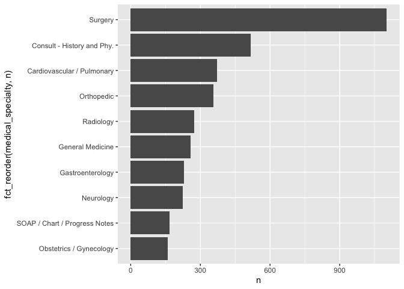

lab06
================
Megan Tran
\`September 28, 2022

``` r
library(tidytext)
library(tidyverse)
```

    ## ── Attaching packages ─────────────────────────────────────── tidyverse 1.3.2 ──
    ## ✔ ggplot2 3.3.6     ✔ purrr   0.3.4
    ## ✔ tibble  3.1.8     ✔ dplyr   1.0.9
    ## ✔ tidyr   1.2.0     ✔ stringr 1.4.1
    ## ✔ readr   2.1.2     ✔ forcats 0.5.2
    ## ── Conflicts ────────────────────────────────────────── tidyverse_conflicts() ──
    ## ✖ dplyr::filter() masks stats::filter()
    ## ✖ dplyr::lag()    masks stats::lag()

``` r
library(dplyr)
library(ggplot2)
library(forcats)
```

## 1. Read in the data

``` r
if (!file.exists("mtsamples.csv")) {
download.file("https://raw.githubusercontent.com/USCbiostats/data-science-data/master/00_mtsamples/mtsamples.csv", "mtsamples.csv", method="libcurl", timeout = 60) 
}
mts <- read.csv("mtsamples.csv") 
str(mts)
```

    ## 'data.frame':    4999 obs. of  6 variables:
    ##  $ X                : int  0 1 2 3 4 5 6 7 8 9 ...
    ##  $ description      : chr  " A 23-year-old white female presents with complaint of allergies." " Consult for laparoscopic gastric bypass." " Consult for laparoscopic gastric bypass." " 2-D M-Mode. Doppler.  " ...
    ##  $ medical_specialty: chr  " Allergy / Immunology" " Bariatrics" " Bariatrics" " Cardiovascular / Pulmonary" ...
    ##  $ sample_name      : chr  " Allergic Rhinitis " " Laparoscopic Gastric Bypass Consult - 2 " " Laparoscopic Gastric Bypass Consult - 1 " " 2-D Echocardiogram - 1 " ...
    ##  $ transcription    : chr  "SUBJECTIVE:,  This 23-year-old white female presents with complaint of allergies.  She used to have allergies w"| __truncated__ "PAST MEDICAL HISTORY:, He has difficulty climbing stairs, difficulty with airline seats, tying shoes, used to p"| __truncated__ "HISTORY OF PRESENT ILLNESS: , I have seen ABC today.  He is a very pleasant gentleman who is 42 years old, 344 "| __truncated__ "2-D M-MODE: , ,1.  Left atrial enlargement with left atrial diameter of 4.7 cm.,2.  Normal size right and left "| __truncated__ ...
    ##  $ keywords         : chr  "allergy / immunology, allergic rhinitis, allergies, asthma, nasal sprays, rhinitis, nasal, erythematous, allegr"| __truncated__ "bariatrics, laparoscopic gastric bypass, weight loss programs, gastric bypass, atkin's diet, weight watcher's, "| __truncated__ "bariatrics, laparoscopic gastric bypass, heart attacks, body weight, pulmonary embolism, potential complication"| __truncated__ "cardiovascular / pulmonary, 2-d m-mode, doppler, aortic valve, atrial enlargement, diastolic function, ejection"| __truncated__ ...

``` r
mts <- as_tibble(mts)
mts
```

    ## # A tibble: 4,999 × 6
    ##        X description                             medic…¹ sampl…² trans…³ keywo…⁴
    ##    <int> <chr>                                   <chr>   <chr>   <chr>   <chr>  
    ##  1     0 " A 23-year-old white female presents … " Alle… " Alle… "SUBJE… "aller…
    ##  2     1 " Consult for laparoscopic gastric byp… " Bari… " Lapa… "PAST … "baria…
    ##  3     2 " Consult for laparoscopic gastric byp… " Bari… " Lapa… "HISTO… "baria…
    ##  4     3 " 2-D M-Mode. Doppler.  "               " Card… " 2-D … "2-D M… "cardi…
    ##  5     4 " 2-D Echocardiogram"                   " Card… " 2-D … "1.  T… "cardi…
    ##  6     5 " Morbid obesity.  Laparoscopic anteco… " Bari… " Lapa… "PREOP… "baria…
    ##  7     6 " Liposuction of the supraumbilical ab… " Bari… " Lipo… "PREOP… "baria…
    ##  8     7 " 2-D Echocardiogram"                   " Card… " 2-D … "2-D E… "cardi…
    ##  9     8 " Suction-assisted lipectomy - lipodys… " Bari… " Lipe… "PREOP… "baria…
    ## 10     9 " Echocardiogram and Doppler"           " Card… " 2-D … "DESCR… "cardi…
    ## # … with 4,989 more rows, and abbreviated variable names ¹​medical_specialty,
    ## #   ²​sample_name, ³​transcription, ⁴​keywords

\##Question 1: What specialties do we have?

We can use count() from dplyr to figure out how many records are there
per specialty?

``` r
specialties <-
    mts %>%
    count(medical_specialty)

specialties %>%
  arrange(desc(n)) %>%
knitr::kable()
```

| medical_specialty             |    n |
|:------------------------------|-----:|
| Surgery                       | 1103 |
| Consult - History and Phy.    |  516 |
| Cardiovascular / Pulmonary    |  372 |
| Orthopedic                    |  355 |
| Radiology                     |  273 |
| General Medicine              |  259 |
| Gastroenterology              |  230 |
| Neurology                     |  223 |
| SOAP / Chart / Progress Notes |  166 |
| Obstetrics / Gynecology       |  160 |
| Urology                       |  158 |
| Discharge Summary             |  108 |
| ENT - Otolaryngology          |   98 |
| Neurosurgery                  |   94 |
| Hematology - Oncology         |   90 |
| Ophthalmology                 |   83 |
| Nephrology                    |   81 |
| Emergency Room Reports        |   75 |
| Pediatrics - Neonatal         |   70 |
| Pain Management               |   62 |
| Psychiatry / Psychology       |   53 |
| Office Notes                  |   51 |
| Podiatry                      |   47 |
| Dermatology                   |   29 |
| Cosmetic / Plastic Surgery    |   27 |
| Dentistry                     |   27 |
| Letters                       |   23 |
| Physical Medicine - Rehab     |   21 |
| Sleep Medicine                |   20 |
| Endocrinology                 |   19 |
| Bariatrics                    |   18 |
| IME-QME-Work Comp etc.        |   16 |
| Chiropractic                  |   14 |
| Diets and Nutritions          |   10 |
| Rheumatology                  |   10 |
| Speech - Language             |    9 |
| Autopsy                       |    8 |
| Lab Medicine - Pathology      |    8 |
| Allergy / Immunology          |    7 |
| Hospice - Palliative Care     |    6 |

There are ‘r nrow(specialties)’ medical specialties.

``` r
specialties %>%
  top_n(10) %>%
  ggplot( aes(x = n, y = fct_reorder(medical_specialty,n))) + 
    geom_col()
```

    ## Selecting by n

<!-- -->

The distribution is not at all uniform.

\##Question 2 Visualize the top 20 most frequent words in the
transcription column

Tokenize the the words in the transcription column Count the number of
times each token appears Visualize the top 20 most frequent words

``` r
mts %>%
  unnest_tokens(word, transcription) %>%
  #anti_join(stop_words, by = c("word")) %>%
  count(word, sort = TRUE) %>%
  top_n(20, n) %>%
  ggplot(aes(n, fct_reorder(word, n))) +
  geom_col()
```

<!-- -->

There are a lot of stopwords here, non-specific to medical text. We do
see “patient”, phew!

\##Question 3 Redo analysis in Q2 and remove stopwords.

Redo visualization but remove stopwords first Bonus points if you remove
numbers as well

``` r
mts %>%
  unnest_tokens(word, transcription) %>%
  count(word, sort = TRUE) %>%
  anti_join(stop_words, by = c("word")) %>%
  # use regular expression to filter out numbers
  filter( !grepl(pattern = "^[0-9]+$",x = word)) %>%
  top_n(20, n) %>%
  ggplot(aes(n, fct_reorder(word, n))) +
  geom_col()
```

<!-- --> What do we see
know that we have removed stop words? Does it give us a better idea of
what the text is about?

Removing the stopwords and numbers gives us a much better idea of what
the text is about

\##Question 4 repeat question 2, but this time tokenize into bi-grams.

``` r
mts %>%
  unnest_ngrams(bigram, transcription, n=2) %>%
  count(bigram, sort = TRUE) %>%
  top_n(20, n) %>%
  ggplot(aes(n, fct_reorder(bigram, n))) +
  geom_col()
```

<!-- -->

how does the result change if you look at tri-grams?

``` r
mts %>%
  unnest_ngrams(trigram, transcription, n=3) %>%
  count(trigram, sort = TRUE) %>%
  top_n(20, n) %>%
  ggplot(aes(n, fct_reorder(trigram, n))) +
  geom_col()
```

<!-- -->

The top 20 trigrams seemed to find a few more medical word groups than
bigrams.

\##Question 5 Using the results you got from questions 4. Pick a word
and count the words that appears after and before it.

``` r
ptbigram <-
mts %>%
  unnest_ngrams(bigram, transcription, n=2) %>%
  separate(bigram, into = c("word1", "word2"), sep = " ") %>%
  select(word1, word2) %>%
  filter(word1 == "patient" | word2 == "patient")
```

Words appearing before patient:

``` r
ptbigram %>%
  filter(word2=="patient") %>%
  count(word1, sort=TRUE) %>%
  anti_join(stop_words, by = c("word1" = "word")) %>%
  top_n(10) %>%
knitr::kable()
```

    ## Selecting by n

| word1       |   n |
|:------------|----:|
| history     | 101 |
| procedure   |  32 |
| female      |  26 |
| sample      |  23 |
| male        |  22 |
| illness     |  16 |
| plan        |  16 |
| indications |  15 |
| allergies   |  14 |
| correct     |  11 |
| detail      |  11 |

Words appearing after patient:

``` r
ptbigram %>%
  filter(word1=="patient") %>%
  count(word2, sort=TRUE) %>%
  anti_join(stop_words, by = c("word2" = "word")) %>%
  top_n(10) %>%
knitr::kable()
```

    ## Selecting by n

| word2      |   n |
|:-----------|----:|
| tolerated  | 994 |
| denies     | 552 |
| underwent  | 180 |
| received   | 160 |
| reports    | 155 |
| understood | 113 |
| lives      |  81 |
| admits     |  69 |
| appears    |  68 |
| including  |  67 |
