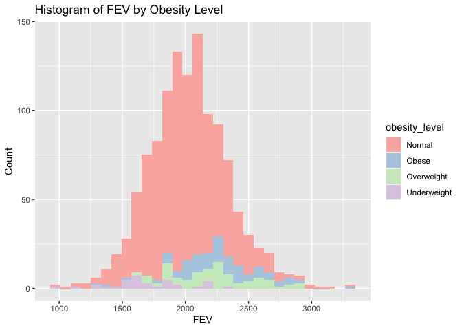

HW2
================
Megan Tran
\`October 3, 2022

``` r
library(tidytext)
library(tidyverse)
```

    ## ── Attaching packages ─────────────────────────────────────── tidyverse 1.3.2 ──
    ## ✔ ggplot2 3.3.6     ✔ purrr   0.3.4
    ## ✔ tibble  3.1.8     ✔ dplyr   1.0.9
    ## ✔ tidyr   1.2.0     ✔ stringr 1.4.1
    ## ✔ readr   2.1.2     ✔ forcats 0.5.2
    ## ── Conflicts ────────────────────────────────────────── tidyverse_conflicts() ──
    ## ✖ dplyr::filter() masks stats::filter()
    ## ✖ dplyr::lag()    masks stats::lag()

``` r
library(dplyr)
library(dtplyr)
library(ggplot2)
library(data.table)
```

    ## 
    ## Attaching package: 'data.table'
    ## 
    ## The following objects are masked from 'package:dplyr':
    ## 
    ##     between, first, last
    ## 
    ## The following object is masked from 'package:purrr':
    ## 
    ##     transpose

\#Read in the data

``` r
if (!file.exists("individual.csv")) {
download.file("https://raw.githubusercontent.com/USCbiostats/data-science-data/master/01_chs/chs_individual.csv", "individual.csv", method="libcurl", timeout = 60) 
}
ind <- data.table::fread("individual.csv")

str(ind)
```

    ## Classes 'data.table' and 'data.frame':   1200 obs. of  23 variables:
    ##  $ sid          : int  1 2 6 7 8 10 13 16 19 21 ...
    ##  $ townname     : chr  "Lancaster" "Lancaster" "Lancaster" "Lancaster" ...
    ##  $ male         : int  1 1 0 0 0 1 1 0 0 0 ...
    ##  $ race         : chr  "W" "W" "B" "O" ...
    ##  $ hispanic     : int  0 0 0 0 1 1 1 0 0 1 ...
    ##  $ agepft       : num  10.15 10.46 10.1 10.75 9.78 ...
    ##  $ height       : int  123 145 145 156 132 NA 140 141 NA 126 ...
    ##  $ weight       : int  54 77 143 72 61 NA 79 74 NA 59 ...
    ##  $ bmi          : num  16.2 16.6 30.9 13.4 15.9 ...
    ##  $ asthma       : int  0 0 0 0 0 0 0 1 0 0 ...
    ##  $ active_asthma: int  0 0 0 0 0 1 0 0 0 0 ...
    ##  $ father_asthma: int  0 0 0 NA 1 1 0 0 0 0 ...
    ##  $ mother_asthma: int  0 0 0 0 0 0 0 1 0 0 ...
    ##  $ wheeze       : int  0 1 0 1 1 0 0 1 0 0 ...
    ##  $ hayfever     : int  0 0 1 0 1 0 0 0 0 0 ...
    ##  $ allergy      : int  0 0 0 0 1 0 0 1 0 1 ...
    ##  $ educ_parent  : int  3 5 2 2 3 1 3 3 3 3 ...
    ##  $ smoke        : int  0 0 0 1 0 0 0 1 0 0 ...
    ##  $ pets         : int  1 1 0 1 1 1 1 1 1 1 ...
    ##  $ gasstove     : int  1 0 1 1 0 1 0 1 1 1 ...
    ##  $ fev          : num  1650 2273 2012 1643 1652 ...
    ##  $ fvc          : num  1800 2721 2257 2061 1996 ...
    ##  $ mmef         : num  2538 2366 1819 1462 1607 ...
    ##  - attr(*, ".internal.selfref")=<externalptr>

``` r
if (!file.exists("regional.csv")) {
download.file("https://raw.githubusercontent.com/USCbiostats/data-science-data/master/01_chs/chs_regional.csv", "regional.csv", method="libcurl", timeout = 60) 
}
reg <- data.table::fread("regional.csv")

str(reg)
```

    ## Classes 'data.table' and 'data.frame':   12 obs. of  27 variables:
    ##  $ townname   : chr  "Alpine" "Lake Elsinore" "Lake Gregory" "Lancaster" ...
    ##  $ pm25_mass  : num  8.74 12.35 7.66 8.5 5.96 ...
    ##  $ pm25_so4   : num  1.73 1.9 1.07 0.91 1.08 3.23 2.69 2.43 2.59 0.79 ...
    ##  $ pm25_no3   : num  1.59 2.98 2.07 1.87 0.73 6.22 12.2 8.66 7.2 1.38 ...
    ##  $ pm25_nh4   : num  0.88 1.36 0.91 0.78 0.41 2.57 4.25 3.14 2.71 0.61 ...
    ##  $ pm25_oc    : num  2.54 3.64 2.46 4.43 1.45 ...
    ##  $ pm25_ec    : num  0.48 0.62 0.4 0.55 0.13 1.36 1.25 0.94 1.17 0.4 ...
    ##  $ pm25_om    : num  3.04 4.36 2.96 5.32 1.74 6.25 14.2 6.32 6.71 3.97 ...
    ##  $ pm10_oc    : num  3.25 4.66 3.16 5.68 1.86 ...
    ##  $ pm10_ec    : num  0.49 0.63 0.41 0.56 0.14 1.39 1.28 0.96 1.19 0.41 ...
    ##  $ pm10_tc    : num  3.75 5.29 3.57 8.61 1.99 ...
    ##  $ formic     : num  1.03 1.18 0.66 0.88 0.34 1.57 1.9 1.72 2.77 0.74 ...
    ##  $ acetic     : num  2.49 3.56 2.36 2.88 0.75 2.94 5.14 3.92 4.24 2.11 ...
    ##  $ hcl        : num  0.41 0.46 0.28 0.22 0.33 0.73 0.46 0.47 0.55 0.31 ...
    ##  $ hno3       : num  1.98 2.63 2.28 1.8 0.43 2.67 3.33 3.43 4.07 0.97 ...
    ##  $ o3_max     : num  65.8 66.7 84.4 54.8 43.9 ...
    ##  $ o3106      : num  55 54.4 67 43.9 37.7 ...
    ##  $ o3_24      : num  41.2 32.2 57.8 32.9 28.4 ...
    ##  $ no2        : num  12.18 17.03 7.62 15.77 4.6 ...
    ##  $ pm10       : num  24.7 34.2 20.1 25 18.4 ...
    ##  $ no_24hr    : num  2.48 7.07 NA 12.68 2.05 ...
    ##  $ pm2_5_fr   : num  10.28 14.53 9.01 NA NA ...
    ##  $ iacid      : num  2.39 3.09 2.56 2.02 0.76 3.4 3.79 3.9 4.62 1.28 ...
    ##  $ oacid      : num  3.52 4.74 3.02 3.76 1.09 4.51 7.04 5.64 7.01 2.85 ...
    ##  $ total_acids: num  5.5 7.37 5.3 5.56 1.52 ...
    ##  $ lon        : num  -117 -117 -117 -118 -120 ...
    ##  $ lat        : num  32.8 33.7 34.2 34.7 34.6 ...
    ##  - attr(*, ".internal.selfref")=<externalptr>

\#Merging the 2 datasets, making sure there’s no duplicates

``` r
nrow(reg)
```

    ## [1] 12

``` r
nrow(ind)
```

    ## [1] 1200

``` r
data <-
merge(
  # Data
  x     = ind,      
  y     = reg, 
  # List of variables to match
  by.x  = "townname",
  by.y  = "townname", 
  # Which obs to keep?
  all.x = TRUE,      
  all.y = FALSE
  ) 
```

\##Data Wrangling

\#Question 1 Impute data

``` r
nrow(data)
```

    ## [1] 1200

There are still 1200 rows in the merged dataset.

\#missing values?

``` r
mean(is.na(data))
```

    ## [1] 0.02782313

Although the proportion of missing values is low, I’ll be imputing it
with the average from “male” “hispanic”.

\#impute missing values with average from “male” and “hispanic”

``` r
data[, bmi_imp := fcoalesce(bmi, mean(bmi, na.rm = TRUE)),
by = .(male,hispanic)]
```

``` r
data[, fev_imp := fcoalesce(fev, mean(fev, na.rm = TRUE)),
by = .(male,hispanic)]
```

``` r
data[, asthma_imp := fcoalesce(as.numeric(asthma), mean(asthma, na.rm = TRUE)),
by = .(male,hispanic)]
```

\#Question 2 Create a new categorical variable named “obesity_level”
using the BMI measurement (underweight BMI\<14; normal BMI 14-22;
overweight BMI 22-24; obese BMI\>24). To make sure the variable is
rightly coded, create a summary table that contains the minimum BMI,
maximum BMI, and the total number of observations per category.

``` r
data$obesity_level <- as.factor(ifelse(data$bmi_imp<14, 'Underweight',
                              ifelse(data$bmi_imp>=14 & data$bmi_imp<22, 'Normal',
                              ifelse(data$bmi_imp>=22 & data$bmi_imp<=24, 'Overweight',
                              ifelse(data$bmi_imp>24, 'Obese','Missing')))))
```

``` r
data[, .(
    min_bmi      = min(bmi_imp, na.rm=TRUE),
    max_bmi   = max(bmi_imp, na.rm=TRUE), count = length(bmi_imp)
    ),
    by = obesity_level
    ][order(obesity_level)] 
```

    ##    obesity_level  min_bmi  max_bmi count
    ## 1:        Normal 14.00380 21.96387   975
    ## 2:         Obese 24.00647 41.26613   103
    ## 3:    Overweight 22.02353 23.99650    87
    ## 4:   Underweight 11.29640 13.98601    35

\#Question 3 Create another categorical variable named
“smoke_gas_exposure” that summarizes “Second Hand Smoke” and “Gas
Stove.” The variable should have four categories in total.

``` r
data$smoke_gas_exposure <- as.factor(ifelse(data$smoke==1 & data$gasstove==1, 'Both',
                                     ifelse(data$smoke==1 & data$gasstove==0, 'SmokeOnly',
                                            ifelse(data$smoke==0 & data$gasstove==1, 'GasOnly',
                                                   ifelse(data$smoke==0 & data$gasstove==0, 'None', 'Missing')))))
```

``` r
summary(data$smoke_gas_exposure)
```

    ##      Both   GasOnly      None SmokeOnly      NA's 
    ##       151       739       214        36        60

\#Question 4 Create four summary tables showing the average (or
proportion, if binary) and sd of “Forced expiratory volume in 1 second
(ml)” and asthma indicator by town, sex, obesity level, and
“smoke_gas_exposure.”

``` r
data[, .(
    mean_fev     = mean(fev_imp, na.rm=TRUE),
    sd_fev       = sd(fev_imp, na.rm=TRUE), 
    prop_asthma  = mean(asthma_imp, na.rm=TRUE),
    sd_asthma    = sd(asthma_imp, na.rm=TRUE)
    ),
    by = townname
    ][order(townname)] 
```

    ##          townname mean_fev   sd_fev prop_asthma sd_asthma
    ##  1:        Alpine 2087.101 291.1768   0.1144423 0.3139348
    ##  2:    Atascadero 2075.897 324.0935   0.2528408 0.4340107
    ##  3: Lake Elsinore 2038.849 303.6956   0.1274366 0.3255095
    ##  4:  Lake Gregory 2084.700 319.9593   0.1512392 0.3585609
    ##  5:     Lancaster 2003.044 317.1298   0.1640054 0.3674206
    ##  6:        Lompoc 2034.354 351.0454   0.1142335 0.3139431
    ##  7:    Long Beach 1985.861 319.4625   0.1359886 0.3370219
    ##  8:     Mira Loma 1985.202 324.9634   0.1582359 0.3572088
    ##  9:     Riverside 1989.881 277.5065   0.1100000 0.3144660
    ## 10:     San Dimas 2026.794 318.7845   0.1712392 0.3771647
    ## 11:   Santa Maria 2025.750 312.1725   0.1348240 0.3372912
    ## 12:        Upland 2024.266 343.1637   0.1212392 0.3263737

``` r
data[, .(
    mean_fev     = mean(fev_imp, na.rm=TRUE),
    sd_fev       = sd(fev_imp, na.rm=TRUE), 
    prop_asthma  = mean(asthma_imp, na.rm=TRUE),
    sd_asthma    = sd(asthma_imp, na.rm=TRUE)
    ),
    by = male
    ]
```

    ##    male mean_fev   sd_fev prop_asthma sd_asthma
    ## 1:    0 1958.911 311.9181   0.1208035 0.3224043
    ## 2:    1 2103.787 307.5123   0.1726819 0.3728876

``` r
data[, .(
    mean_fev     = mean(fev_imp, na.rm=TRUE),
    sd_fev       = sd(fev_imp, na.rm=TRUE), 
    prop_asthma  = mean(asthma_imp, na.rm=TRUE),
    sd_asthma    = sd(asthma_imp, na.rm=TRUE)
    ),
    by = obesity_level
    ][order(obesity_level)] 
```

    ##    obesity_level mean_fev   sd_fev prop_asthma sd_asthma
    ## 1:        Normal 1999.794 295.1964  0.14036063 0.3426863
    ## 2:         Obese 2266.154 325.4710  0.20819643 0.4034416
    ## 3:    Overweight 2224.322 317.4261  0.16409910 0.3687886
    ## 4:   Underweight 1698.327 303.3983  0.08571429 0.2840286

``` r
data[, .(
    mean_fev     = mean(fev_imp, na.rm=TRUE),
    sd_fev       = sd(fev_imp, na.rm=TRUE), 
    prop_asthma  = mean(asthma_imp, na.rm=TRUE),
    sd_asthma    = sd(asthma_imp, na.rm=TRUE)
    ),
    by = smoke_gas_exposure
    ][order(smoke_gas_exposure)] 
```

    ##    smoke_gas_exposure mean_fev   sd_fev prop_asthma sd_asthma
    ## 1:               Both 2019.867 298.9728   0.1303123 0.3319599
    ## 2:            GasOnly 2025.989 317.6305   0.1478616 0.3531690
    ## 3:               None 2055.356 330.4169   0.1476213 0.3522319
    ## 4:          SmokeOnly 2055.714 295.6475   0.1717490 0.3768879
    ## 5:               <NA> 2001.878 340.2592   0.1475272 0.3179866

\##Looking at the Data (EDA)

EDA Checklist

Formulate a question: 1. What is the association between BMI and FEV
(forced expiratory volume)? 2. What is the association between smoke and
gas exposure and FEV? 3. What is the association between PM2.5 exposure
and FEV? Read in the data: done Check the dimensions and headers and
footers of the data:

``` r
dim(data)
```

    ## [1] 1200   54

``` r
head(data)
```

    ##    townname sid male race hispanic    agepft height weight      bmi asthma
    ## 1:   Alpine 835    0    W        0 10.099932    143     69 15.33749      0
    ## 2:   Alpine 838    0    O        1  9.486653    133     62 15.93183      0
    ## 3:   Alpine 839    0    M        1 10.053388    142     86 19.38649      0
    ## 4:   Alpine 840    0    W        0  9.965777    146     78 16.63283      0
    ## 5:   Alpine 841    1    W        1 10.548939    150     78 15.75758      0
    ## 6:   Alpine 842    1    M        1  9.489391    139     65 15.29189      0
    ##    active_asthma father_asthma mother_asthma wheeze hayfever allergy
    ## 1:             0             0             0      0        0       1
    ## 2:             0             0             0      0        0       0
    ## 3:             0             0             1      1        1       1
    ## 4:             0             0             0      0        0       0
    ## 5:             0             0             0      0        0       0
    ## 6:             0             0             0      1        0       0
    ##    educ_parent smoke pets gasstove      fev      fvc     mmef pm25_mass
    ## 1:           3     0    1        0 2529.276 2826.316 3406.579      8.74
    ## 2:           4    NA    1        0 1737.793 1963.545 2133.110      8.74
    ## 3:           3     1    1        0 2121.711 2326.974 2835.197      8.74
    ## 4:          NA    NA    0       NA 2466.791 2638.221 3466.464      8.74
    ## 5:           5     0    1        0 2251.505 2594.649 2445.151      8.74
    ## 6:           1     1    1        0 2188.716 2423.934 2524.599      8.74
    ##    pm25_so4 pm25_no3 pm25_nh4 pm25_oc pm25_ec pm25_om pm10_oc pm10_ec pm10_tc
    ## 1:     1.73     1.59     0.88    2.54    0.48    3.04    3.25    0.49    3.75
    ## 2:     1.73     1.59     0.88    2.54    0.48    3.04    3.25    0.49    3.75
    ## 3:     1.73     1.59     0.88    2.54    0.48    3.04    3.25    0.49    3.75
    ## 4:     1.73     1.59     0.88    2.54    0.48    3.04    3.25    0.49    3.75
    ## 5:     1.73     1.59     0.88    2.54    0.48    3.04    3.25    0.49    3.75
    ## 6:     1.73     1.59     0.88    2.54    0.48    3.04    3.25    0.49    3.75
    ##    formic acetic  hcl hno3 o3_max o3106 o3_24   no2  pm10 no_24hr pm2_5_fr
    ## 1:   1.03   2.49 0.41 1.98  65.82 55.05 41.23 12.18 24.73    2.48    10.28
    ## 2:   1.03   2.49 0.41 1.98  65.82 55.05 41.23 12.18 24.73    2.48    10.28
    ## 3:   1.03   2.49 0.41 1.98  65.82 55.05 41.23 12.18 24.73    2.48    10.28
    ## 4:   1.03   2.49 0.41 1.98  65.82 55.05 41.23 12.18 24.73    2.48    10.28
    ## 5:   1.03   2.49 0.41 1.98  65.82 55.05 41.23 12.18 24.73    2.48    10.28
    ## 6:   1.03   2.49 0.41 1.98  65.82 55.05 41.23 12.18 24.73    2.48    10.28
    ##    iacid oacid total_acids       lon      lat  bmi_imp  fev_imp asthma_imp
    ## 1:  2.39  3.52         5.5 -116.7664 32.83505 15.33749 2529.276          0
    ## 2:  2.39  3.52         5.5 -116.7664 32.83505 15.93183 1737.793          0
    ## 3:  2.39  3.52         5.5 -116.7664 32.83505 19.38649 2121.711          0
    ## 4:  2.39  3.52         5.5 -116.7664 32.83505 16.63283 2466.791          0
    ## 5:  2.39  3.52         5.5 -116.7664 32.83505 15.75758 2251.505          0
    ## 6:  2.39  3.52         5.5 -116.7664 32.83505 15.29189 2188.716          0
    ##    obesity_level smoke_gas_exposure
    ## 1:        Normal               None
    ## 2:        Normal               <NA>
    ## 3:        Normal          SmokeOnly
    ## 4:        Normal               <NA>
    ## 5:        Normal               None
    ## 6:        Normal          SmokeOnly

``` r
tail(data)
```

    ##    townname  sid male race hispanic    agepft height weight      bmi asthma
    ## 1:   Upland 1866    0    O        1  9.806982    139     60 14.11559      0
    ## 2:   Upland 1867    0    M        1  9.618070    140     71 16.46568      0
    ## 3:   Upland 2031    1    W        0  9.798768    135     83 20.70084      0
    ## 4:   Upland 2032    1    W        0  9.549624    137     59 14.28855      0
    ## 5:   Upland 2033    0    M        0 10.121834    130     67 18.02044      0
    ## 6:   Upland 2053    0    W        0        NA     NA     NA       NA      0
    ##    active_asthma father_asthma mother_asthma wheeze hayfever allergy
    ## 1:             0            NA             0      0       NA      NA
    ## 2:             0             1             0      0        0       0
    ## 3:             0             0             0      1        0       1
    ## 4:             0             0             1      1        1       1
    ## 5:             1             0             0      1        1       0
    ## 6:             0             0             0      0        0       0
    ##    educ_parent smoke pets gasstove      fev      fvc     mmef pm25_mass
    ## 1:           3     0    1        0 1691.275 1928.859 1890.604     22.46
    ## 2:           3     0    1        0 1733.338 1993.040 2072.643     22.46
    ## 3:           3     0    1        1 2034.177 2505.535 1814.075     22.46
    ## 4:           3     0    1        1 2077.703 2275.338 2706.081     22.46
    ## 5:           3     0    1        1 1929.866 2122.148 2558.054     22.46
    ## 6:           3     0    1        0       NA       NA       NA     22.46
    ##    pm25_so4 pm25_no3 pm25_nh4 pm25_oc pm25_ec pm25_om pm10_oc pm10_ec pm10_tc
    ## 1:     2.65     7.75     2.96    6.49    1.19    7.79    8.32    1.22    9.54
    ## 2:     2.65     7.75     2.96    6.49    1.19    7.79    8.32    1.22    9.54
    ## 3:     2.65     7.75     2.96    6.49    1.19    7.79    8.32    1.22    9.54
    ## 4:     2.65     7.75     2.96    6.49    1.19    7.79    8.32    1.22    9.54
    ## 5:     2.65     7.75     2.96    6.49    1.19    7.79    8.32    1.22    9.54
    ## 6:     2.65     7.75     2.96    6.49    1.19    7.79    8.32    1.22    9.54
    ##    formic acetic  hcl hno3 o3_max o3106 o3_24   no2 pm10 no_24hr pm2_5_fr iacid
    ## 1:   2.67   4.73 0.46 4.03  63.83  46.5  22.2 37.97 40.8   18.48    27.73  4.49
    ## 2:   2.67   4.73 0.46 4.03  63.83  46.5  22.2 37.97 40.8   18.48    27.73  4.49
    ## 3:   2.67   4.73 0.46 4.03  63.83  46.5  22.2 37.97 40.8   18.48    27.73  4.49
    ## 4:   2.67   4.73 0.46 4.03  63.83  46.5  22.2 37.97 40.8   18.48    27.73  4.49
    ## 5:   2.67   4.73 0.46 4.03  63.83  46.5  22.2 37.97 40.8   18.48    27.73  4.49
    ## 6:   2.67   4.73 0.46 4.03  63.83  46.5  22.2 37.97 40.8   18.48    27.73  4.49
    ##    oacid total_acids       lon      lat  bmi_imp  fev_imp asthma_imp
    ## 1:   7.4       11.43 -117.6484 34.09751 14.11559 1691.275          0
    ## 2:   7.4       11.43 -117.6484 34.09751 16.46568 1733.338          0
    ## 3:   7.4       11.43 -117.6484 34.09751 20.70084 2034.177          0
    ## 4:   7.4       11.43 -117.6484 34.09751 14.28855 2077.703          0
    ## 5:   7.4       11.43 -117.6484 34.09751 18.02044 1929.866          0
    ## 6:   7.4       11.43 -117.6484 34.09751 18.05281 1945.743          0
    ##    obesity_level smoke_gas_exposure
    ## 1:        Normal               None
    ## 2:        Normal               None
    ## 3:        Normal            GasOnly
    ## 4:        Normal            GasOnly
    ## 5:        Normal            GasOnly
    ## 6:        Normal               None

Check the variable types in the data: done

Take a closer look at some/all of the variables: done Validate with an
external source Conduct some summary statistics to answer the initial
question

\#Question 1. Facet plot showing scatterplots with regression lines of
BMI vs FEV by “townname”.

``` r
ggplot(data = data, mapping = aes(x = bmi_imp, y = fev_imp, color=townname)) + 
  geom_point() + 
  geom_smooth(method = lm, col = "black") +
  labs(title = "Scatterplots of BMI vs FEV by Town") + 
  labs(x = expression("Body Mass Index"), y = "Forced Expiratory Volume") +
  facet_wrap(~ townname, nrow = 3, ncol=4)
```

    ## `geom_smooth()` using formula 'y ~ x'

<!-- --> Based on these
scatterplots, it can be gathered that BMI and FEV are positively
correlated for those in all 12 towns.

\#Question 2 Stacked histograms of FEV by BMI category and FEV by
smoke/gas exposure. Use different color schemes than the ggplot default.

``` r
ggplot(data=data) +
  geom_histogram(mapping = aes(x = fev_imp, fill = obesity_level)) +
        scale_fill_brewer(palette = "Pastel1")
```

    ## `stat_bin()` using `bins = 30`. Pick better value with `binwidth`.

<!-- --> There are a
significantly greater amount of those with “Normal” BMI than any other
category. The second largest group our “Obese”. But there isn’t a clear
association between obesity level and fev.

``` r
ggplot(data=data) +
  geom_histogram(mapping = aes(x = fev_imp, fill = smoke_gas_exposure)) + 
        scale_fill_brewer(palette = "Set2") 
```

    ## `stat_bin()` using `bins = 30`. Pick better value with `binwidth`.

<!-- --> It seems like
second hand smoke and gas exposure together result in the highest FEV.
Being exposed to gas only is closely second. Therefore, there might be a
correlation between FEV and smoke/gas exposure.

\#Question 3 Barchart of BMI by smoke/gas exposure.

``` r
ggplot(data=data) +
  geom_bar(mapping = aes(x = obesity_level, fill = smoke_gas_exposure))
```

<!-- --> From this
barchart, I can see that a majority of people in all groups are exposed
to gas only. Again, there doesn’t seem to be correlation between BMI and
smoke/gas exposure.

\#Question 4 Statistical summary graphs of FEV by BMI (obesity level)
and FEV by smoke/gas exposure category.

``` r
data[!is.na(fev_imp)] %>%
  ggplot(mapping = aes(x=obesity_level, y=fev_imp)) + 
    stat_summary(fun.data = mean_sdl,
  geom = "errorbar")      
```

<!-- --> This
visualization gives me the most information. I can see that as the BMI
increaseses, so do the bars. Perhaps there’s a correlation between the
variables after all.

``` r
data[!is.na(fev_imp)] %>%
  ggplot(mapping = aes(x=smoke_gas_exposure, y=fev_imp)) + 
    stat_summary(fun.data = mean_sdl,
  geom = "errorbar")      
```

<!-- --> The lowest bar
is the “Both” category and shortly after is the “SmokeOnly”. This graph
also indicates that there might be a correlation between the variables.

\#Question 5 A leaflet map showing the concentrations of PM2.5 mass in
each of the CHS communities.

``` r
library(leaflet)
pm25.pal <- colorFactor(topo.colors(12), domain = data$pm25_mass)
leaflet(data) %>% 
   addTiles() %>%
   addCircles (lat = ~lat, lng = ~lon, color = ~pm25.pal(pm25_mass),
                label = ~paste0(pm25_mass),
                opacity=0.01, fillOpacity = 0.05, radius = 5000) %>%
addLegend('bottomleft', pal= pm25.pal, values = (data$pm25_mass),
              title ='PM 2.5 Mass', opacity=1)
```

<!-- -->

As a general trend, the communities that are more north have smaller
concentrations of PM 2.5 than the southern communities.

\#Question 6 Choose a visualization to examine whether PM2.5 mass is
associated with FEV.

``` r
ggplot(data=data) + 
  geom_point(mapping = aes(x = pm25_mass, y = fev_imp))+
  geom_smooth(mapping = aes(x = pm25_mass, y = fev_imp))
```

    ## `geom_smooth()` using method = 'gam' and formula 'y ~ s(x, bs = "cs")'

<!-- --> I don’t see a
correlation because the regression line is almost horizontal.
